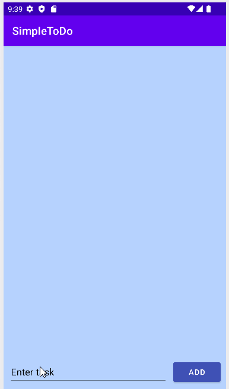

# SimpleToDo

## Features

* [x] User can view a list of todo items
* [x] User can add and remove items from the todo list
* [x] User's list of items persisted upon modification and retrieved properly on app restart

## Video Walkthrough

